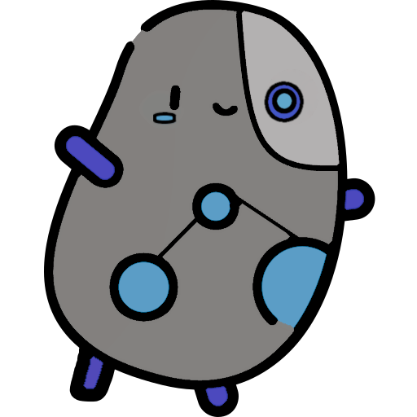
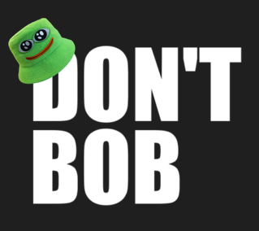

# PotatOS Engine



## Project description ##
This project aims to create a game engine in groups of three. <br>

We have several conditions to abide by :
- The engine has to run on Windows, no cross platform needed.
- It has to be  written in C++. 
- It must have a core and an editor separated. 
- It has to include an already existing physics engine.
- Math used in it mustn’t be from an external library 
- It has to be a  3D engine (3D math should be used and must successfully pass unit tests).<br>
- It has to support scripts, sounds, animations and model import.

<br>
This engine also has to be made in order to create a specific game, in our case we have chosen an Hack ’n’ Slash/Roguelike style with an isometric view as in Hades or the Diablo series, for example.<br>
<br>


## Table of content ##
 - [Clone](#clone)
 - [Game controls](#game-controls)
 - [Functionnality](#functionnality)
 - [Technologie](#technologie)
 - [Specials Thanks](#specials-thanks)
<br>

## Clone ##
``` bash
git clone git@gitlabstudents.isartintra.com:projets/2022_projet_moteur_gp_2026_projet_moteur-potatos_engine.git
```
<br>


## Game Controls ##

| Key         | Action           |
|-------------|------------------|
| W           | Move forward     |
| A           | Strafe left      | 
| S           | Move backward    |
| D           | Strafe right     | 
| Space       | Up               |
| Shift       | Down             |
| E           | Translation Gizmo|
| R           | Rotation Gizmo   |
| T           | Scale Gizmo      |
| Esc         | Exit the program |

They can be remapped
<br>


## Functionnality ##
- [x] Blinn Phong
- [x] Scene Graph
- [x] Resources Manager
- [x] MonoBehavior
- [x] RHI (Render Hardware Interface)
- [x] Gamma Correction
- [x] HDR
- [x] Bloom
- [x] Multithreading
- [x] Shadow Mapping
- [x] Colorblind Mode
- [x] SDH (Subtitles for the Deaf and Hard of hearing)
- [ ] Normal Mapping
- [ ] Instancing

<br>


## Technologie ##
[TDD (Technical Design Document)](https://docs.google.com/document/d/1Zcq7Zri6wgKqm9Bzz0luZPMo--jss52Atc8w6IFItJU/edit?usp=sharing)<br>
- Engine Langage : C++<br>
- Graphic API : [OpenGL](https://www.opengl.org/)
- Physic Engine : [PhysX](https://github.com/NVIDIA-Omniverse/PhysX)
- Sound Library : [Fmod](https://www.fmod.com/download#fmodengine)
- Window Library : [GLFW](https://github.com/glfw/glfw)
- Texture Library : [STB_Image](https://github.com/nothings/stb)
- Asset Import Library : [Assimp](https://github.com/assimp/assimp)
- Graphical User Library : [ImGUI Docking](https://github.com/ocornut/imgui/tree/docking)
- Reflection Library : [Refureku](https://github.com/jsoysouvanh/Refureku)
- Json Library : [Nlohman json](https://github.com/nlohmann/json)
- FreeType : [FreeType](https://freetype.org/)
- ImGuizmo : [ImGuizmo](https://github.com/CedricGuillemet/ImGuizmo)
<br>


## Specials Thanks ##
- Teachers from ISART
- Tutorials
    - [LearnOpenGL](https://learnopengl.com/)
<br>

<hr>
For ISART DIGITAL <br>
<br>


- Omaya LISE
- Kristian GOUPIL
- Vincent DEVINE
<br>

Key dates :
- Start : 20/02/2023
- Alpha : 14/03/2023
- Beta : 03/05/2023
- GOLD : 31/05/2023
- Jury : 06/06/2023
